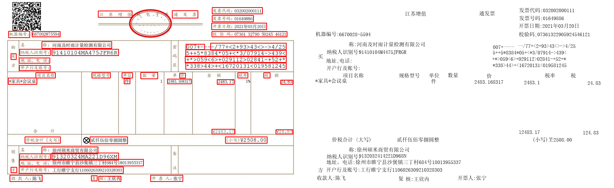

# Readme

## 1、Content--内容概述

本项目是一个智能识别财务报销数据的Demo，主要用于电子发票关键信息的提取与识别，其中用到了深度学习神经网络、opencv和数字图像处理等技术，能达到基本的识别任务。



## 2、Usage--使用流程

### 2.1 环境

- Linux/Window

- python=3.8

- CUDA=10.2

- CUDNN=8.05

  

### 2.2 配置环境

- 需要提前安装pip和python，或者安装anaconda
- 配置python环境

```
方式一：直接安装本人打包好的环境包
pip install -r requirements.txt
or
conda install --yes --file requirements.txt

方式二：官方文档安装
pip install easyocr
```


### 2.3 使用-Inference

- 进入环境
- 进入程序文件夹根目录
- 运行代码main.py

```
python main.py
```

- 运行结果


### 2.4 训练-Train

参考以下文档：

[Network-Recognition](https://github.com/JaidedAI/EasyOCR/blob/master/custom_model.md)

[Network-Detection](https://github.com/JaidedAI/EasyOCR/blob/master/trainer/craft/README.md)


## Reference

[EasyOcr](https://github.com/jaidedai/easyocr)

[Character Region Awareness for Text Detection](https://arxiv.org/pdf/1904.01941.pdf)

[CRAFT](https://github.com/clovaai/CRAFT-pytorch)