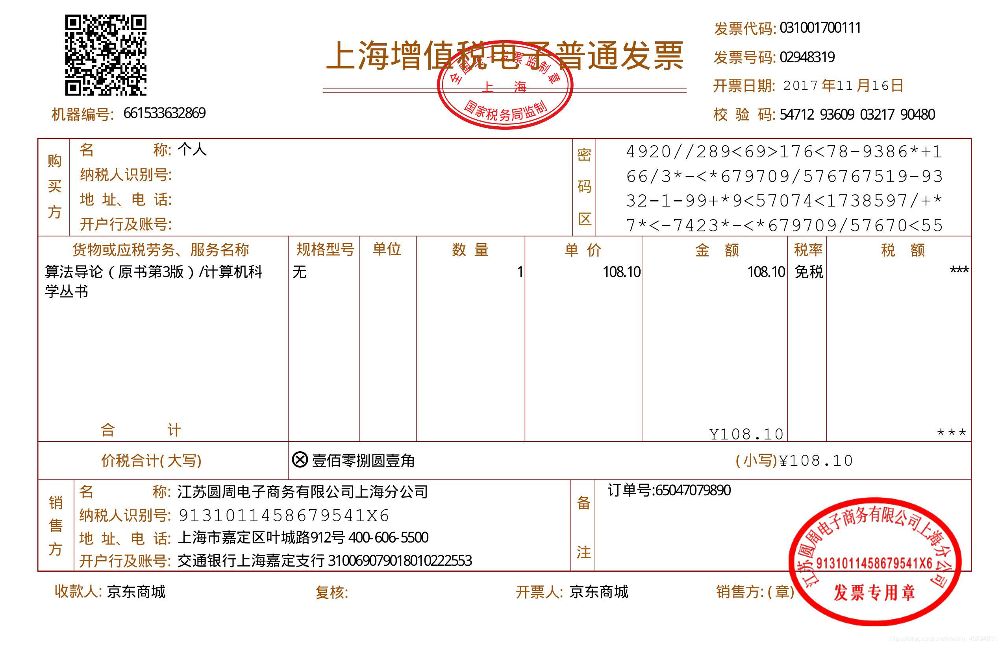
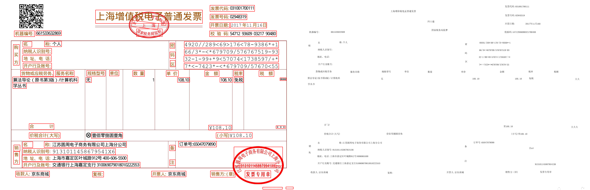

<h1 align='center'> 🚀FastOCR🚀</h1>

本项目是一个智能识别财务报销数据的Demo，主要用于电子发票关键信息的提取与识别，其中用到了深度学习神经网络、opencv和数字图像处理等技术，目前能达到基本的识别任务，后续继续调研改进。

## 1、Content--内容概述

主要研究了 Two-Step 框架下的深度神经网络在智能识别财务数据方面的应用问题，其中涉及文字区域检测、文字内容识别两个具体技术。其中文字区域检测考虑了弯曲、弱光场景下的鲁棒性问题，采用了 CRAFT 网络进行文字区域定位，为下一步提供了准确的保障；文字内容识别考虑了词组之间的时序建模，采用VGG+BiLSTM+CTC 组合网络分别进行文字特征的提取、词语时序建模、内容的分类任务。本文的网络在 SynthText 和 ICDAR2015 上进行预训练，然后在ICDAR2019-LSVT 等中文数据集上进行微调，可以达到应用场景下的发票文字识别精度要求，并且在扭曲场景下也有一定的鲁棒性表现。Doc文件夹下有研究文档介绍。



## 2、Usage--使用流程

### 2.1 环境

- Linux/Window

- python=3.8

- CUDA=10.2

- CUDNN=8.05

  

### 2.2 配置环境

- 需要提前安装pip和python，或者安装anaconda
- 配置python环境

```
方式一：直接安装本人打包好的环境包
pip install -r requirements.txt
or
conda install --yes --file requirements.txt

方式二：官方文档安装
pip install easyocr
```


### 2.3 使用-Inference

- 进入环境
- 进入程序文件夹根目录
- 运行代码main.py

```
python main.py
```

- 运行结果输出在output文件夹下面



### 2.4 训练-Train

trainer文件夹下面包括了文字检测、文字识别网络的训练代码


## Reference

[EasyOcr](https://github.com/jaidedai/easyocr)

[Character Region Awareness for Text Detection](https://arxiv.org/pdf/1904.01941.pdf)

[CRAFT](https://github.com/clovaai/CRAFT-pytorch)